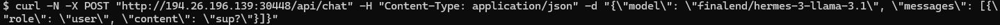

### ollama_999

plug-and-play LLM runtime 

- minimal Ollama Docker container with auto model pull & TCP streaming
- when up, exposes **$HOST/api/chat** endpoint, ready to chat with
- uses by default the **finalend/hermes-3-llama-3.1** model, which allows for more uncensored conversations
- for built-in model's system customization and chat history - https://github.com/7EXLEX3R/chat_999

#### SYSTEM
- Docker

#### RUN
```sh
sh bin/run.sh
# or
docker run -p 11434:11434 7exlex3r/ollama_999:latest
# or with specified custom model
docker run -p 11434:11434 -e OLLAMA_MODEL=llama2:latest 7exlex3r/ollama_999:latest
```

#### TEST
```
curl -N -X POST "http://194.26.196.139:30448/api/chat" -H "Content-Type: application/json" -d "{\"model\": \"finalend/hermes-3-llama-3.1\", \"messages\": [{\"role\": \"user\", \"content\": \"sup?\"}]}"
```

#### ENV
- OLLAMA_MODEL = finalend/hermes-3-llama-3.1

#### USAGE EXAMPLE
- go to https://www.runpod.io
- create a **NVIDIA GPU** pod template
    - use **docker.io/7exlex3r/ollama_999** as the Docker image
    - expose **TCP** port **11434**
    - set **container disk** size to **10GB**
    - *(optional, for GPU access issues)* add `CUDA_VISIBLE_DEVICES=0` env
- run a pod using the created template (works well with the cheapest instances from **GPU** / **Community Cloud** page - e.g. RTX A4000)
- open the container logs to check the status


...


...


- when the app says it's ready for **handling requests...**, check the pod's URL in **Connect** / **Direct TCP Ports** section


...


- in terminal/bash run the **curl** test command from the **TEST** section, adjusting the URL to match the pod's one



- result on client side


- result in logs container logs

